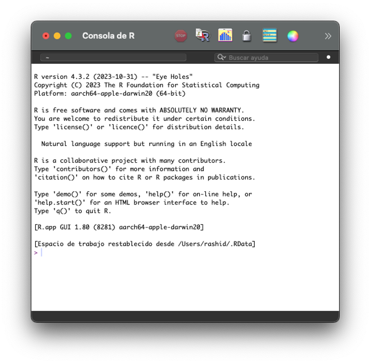
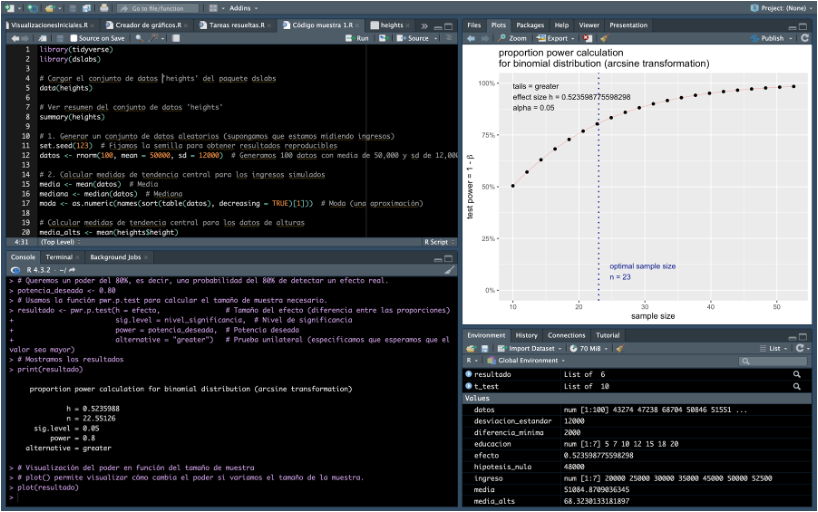

**Introducción a la computación estadística en R**

Este taller está basado en notas de Paul Thibodeau y revisiones de profesores del departamento de psicología de BYU [(vea esa versión aquí)](https://fhssrsc.byu.edu/r-workshop). Adaptado al español y usando ejemplos del libro de Rafael Irizarry [disponible aquí](https://leanpub.com/dslibro). Ha sido revisado de la primeras versión de este taller, brindadas en el Centro Académico de Cómputos de Ciencias Sociales en los pasados semestres.

*Si aún no has instalado R, está disponible [aquí](http://cran.us.r-project.org/). Acto seguido, [baja RStudio](https://posit.co/download/rstudio-desktop/). Puedes también ir a la nube [en Posit Cloud](https://posit.cloud/).*

# Sobre aprender R

R es un lenguaje creado por estadísticos como ambiente interactivo para análisis de datos. En R pueden guardar su trabajo como una secuencia de comandos, conocida como un *script*, que se pueden ejecutar fácilmente en cualquier momento, con portabilidad. Estos *scripts* sirven como un registro del análisis que realizaron, una característica clave que facilita el trabajo [***reproducible***]{.underline}. Si bien es un programa poderoso y flexible, es ciertamente más complicado que programados como el que puedan encontrar en SPSS o STATA, donde pueden señalar con el ratón una opción y ejecutarla. Por otro lado, R es gratuito y de código abierto. En adición es modular y las funcionalidades añadidas complementariamente por terceros también son gratuitos, incluyendo acceso temprano a los métodos y herramientas más recientes que se desarrollan para una amplia variedad de disciplinas, incluyendo la economía, ciencias políticas, sociología, planificación, ecología, geografía o la biología molecular, entre otros.

Mi idea tras esta secuencia de talleres sobre R es brindar una introducción para que puedan interactuar con R tal que los sentimientos de frustración o ansiedad que puedan surgir al trabajar con este lenguaje al usarlo en variedad de circunstancias. Este taller presume en general ciertos conocimientos básicos en estadística, pero abundará en cada parte que se trabaje aunque sea algo como la motivación para las funciones que ejecutaremos. So no tienen experiencia en programación computacional, es posible que partes de este taller resulten confusas o no tengan mucho sentido. Recomiendo que aún así traten de entender lo que puedan, y luego al volver a este taller periódicamente al repasar el contenido, vayan comprendiendo (o trayendo preguntas que no se resuelvan) el material.

Es importante que sepan que la habilidad más útil de antemano es la de saber adónde ir cuando se atasquen. R ayuda bastante en esto. La consola de R, al escribir y ejecutar comandos, brinda retroalimentación inmediata. Hagan uso de esto de manera liberal mientras trabajan el taller, haciendo pequeñas modificaciones a los ejemplos que brinde, hasta que sientan que entienden qué está ocurriendo.

De una vez, cabe señalar que la consola brinda acceso a la función de buscar ayuda interna. Casi todas las funciones (y muchos de los datos pre-almacenados) tienen archivos que les acompañan describiendo qué son las funciones, y cómo usarlas. Pueden acceder a esta información escribiendo `help(función)` (o `?función`), sustituyendo «función» por el nombre de la función que quieras conocer. Es importante leer estos archivos detenidamente la primera vez que te encuentres con una función, pero *también* (posiblemente más) importante es consultarlos con frecuencia. Si tienes una idea de qué quieres hacer, pero no sabes ni recuerdas la función exacta para esto, puedes buscar en los archivos por el término usando doble signo de interrogación (`??regression`).

Hay mucha información adicional en internet. Es difícil buscar en Google por R, ya que es una letra, pero sí se puede encontrar mucho sobre funcionalidades. Para búsqueda más certera se puede ir a [StackOverflow](http://stackoverflow.com/), y buscar el tag de R (`[R]`) junto a tu pregunta o error. Relacionado está el [StackExchange de estadísticas](http://stats.stackexchange.com/), que es como Stack Overflow pero enfocado en la madeja estadística.

Finalmente, antes de empezar, quiero hablar sobre errores. Tanto novatos como expertos encontrarán errores en su código de R. De suceder, al ir ejecutando un *script* o trabajo, cesará el proceso y saldrá impreso un mensaje de error en la consola. Esto puede ser frustrante, en especial al estar iniciando el aprendizaje, pues el error ocurre a menudo muy adentro de las especificidades de una función, y el mensaje de error no guarda relación con lo que el usuario quería hacer. Un error a evitar al empezar a aprender R es que el error es un disparate incomprensible, y resignarse a la frustración y desánimo. Resistan ese impulso; si bien el mensaje no será de inicio informativo, está diseñado para transmitir cierta información con claridad, y entender esa información es clave para resolver el problema (o cambiar de estrategias).

Esta es una secuencia de tres semanas, y en esta lección arrancaremos con lo básico de R, RStudio, y tenemos la meta hoy de que al culminar las primeras dos horas de esta secuencia podamos:

1.  Entender la lógica de RStudio.

2.  Importar, crear, leer y manipular datos y objetos.

3.  Inicios de la visualización y análisis descriptivo.

Durante las próximas tres semanas expandiremos sobre esta base, y profundizaremos el viernes 3 de octubre en visualización avanzada, para datos transversales, series de tiempo, y datos censales así como de otros acercamientos, usando herramientas de `ggplot2` y `sf`. Luego, la tercera semana, el viernes 10 de octubre, entraremos más en *wrangling* de datos, así como en la inferencia estadística, con introducciones en R sobre modelos lineales, jerárquicos y longitudinales, así como de los distintos métodos de verificación de presunciones de modelo. Si bien hay mucho más que se puede hacer con R (e.g. *machine learning,* extracción de datos de la web, procesamiento de cadenas y minería de textos, interacción con Git, trabajos en Unix, o nuevos desarrollos en Quarto), la idea es iniciar la travesía en R, y señalar a dónde pueden buscar ahondar.

## Usando RStudio (y presentando por encima, RMarkdown)

¿Cómo difieren R y RStudio? RStudio es una interfaz que yace encima del programa base R. Es además [**mucho**]{.underline} más amigable y llevadera que R.



R, por su cuenta es una consola sencilla donde teclean y corren código.


RStudio tiene la *Consola* como panel, pero tiene otros paneles en adición que nos ayudan a ubicarnos, como *Environment* (Ambiente) - para que vean los objetos (conjuntos de datos y variables, o funciones) que hayan guardado o creado a través de la sesión *-* el de *Output* (Salida) - donde pueden ver sus archivos en el directorio, sus gráficos, acceder los paquetes y buscar ayuda - y *Source* (Fuente), donde pueden crear y editar tanto archivos o *scripts* de R, como de Markdown, [Quarto](https://quarto.org/docs/get-started/hello/rstudio.html) y [Shiny](https://shiny.posit.co/r/getstarted/shiny-basics/lesson1/index.html) (para dashboards), entre otros formatos.

Estos paneles (y otras configuraciones) son editables, como el caso del R que manejo en mi Mac:



A grosso modo, RMarkdown/Quarto es un tipo de documento que permite la escritura de texto regular junto a secciones o pedazos de R. Esto es útil para explicar por ejemplo tu código, seguido por el código mismo para uso regular. También es útil porque Markdown/Quarto se puede exportar como una página html así como un PDF, o Word lo cual es útil para compartirlo fuera del esquema de R. Si les interesara más sobre RMarkdown, visiten esta [página](https://rmarkdown.rstudio.com/lesson-1.html) o esta para Quarto [aquí](https://quarto.org/docs/get-started/hello/rstudio.html).

# Interacción con la consola de R

```{r paquetes que instalar luego}
#install.packages("dslabs","wooldridge","tidyverse") #Si ya están instalados, comenten con '#' para desactivar esta línea
```

En la forma básica, R es una calculadora para cómputos básicos. Escribe en R (o en un trozo o **chunk** en RMarkdown o Quarto) y el resultado saldrá en la consola al ejecutar o correrlo. Un **chunk** se designa en Markdown con triple \` al inicio y fin, así como {r título de sección}. Ahí va el código. Hoy nos enfocaremos en R, pero esta presentación se hizo en RMarkdown. Pueden correr líneas de su secuencia de códigos al usar Command+Return en Mac, o Control+Enter en la PC. También hay un botón para correr líneas o secciones enteras, así como el *script* entero.

```{r calculadora básica}
1 + 2
13 / 2
2 ^ 6
5 * (2 + 3)
sqrt(81)
```

## Asignando valores a objetos

Claro, R es mucho más que una calculadora básica. La computación con R incluye asignar valores a objetos, y esto se puede hacer con dos maneras básicamente equivalentes:

```{r creando un objeto}
x = 4
x <- 4
```

En ambos casos, `x` representará `4` y R guardará ese significado para las líneas subsiguientes, a menos que reasignes el valor de `x`.

```{r alterando valor de objeto}
x
x + 2
x = 8
x
```

Vale señalar que no se debe confundir la asignación de valor a un objeto (o variable) como una igualdad. Al pensar lo que vimos, debiéramos pensar que *asignamos 4 a x* o *x recibe 4* o *x tiene 4*, mas no *x es igual a 4*. Aunque `=` es consistente con otros lenguajes de programación, muchos preferimos `<-` al hacer la acción tomada a cabo más evidente. Si tenían curiosidad, se prueba la igualdad con doble signo de igualdad (`==`), y eso produce algo distinto:

```{r equality_tests}
2 == 2
2 == 3
```

Está bien usar nombres de variables como `x` para ejemplos matemáticos simples como los anteriores. Sin embargo, cuando escribas código para realizar análisis, debes tener cuidado de usar nombres descriptivos. El código donde las cosas se llaman `id_sujeto`, `condición` o `edad` serán más largos que `x`, `y` y `z`, pero tendrán **mucho** más sentido al volver a ellos meses después al hacer sus artículos o trabajos de investigación. Hay, eso sí, ciertas reglas para nombres: pueden ser cualquier carácter alfanumérico, pero el primer carácter ha de ser una letra. No se permiten espacios: la computadora no entiende que quieres trabajar con dos palabras como si fuera un concepto; son dos términos separados. En ese caso considera unir palabras con `_` y `.`. R también puede trabajar con datos categóricos, no sólo numéricos:

```{r asignando valores categóricos}
y<-"Puerto Rico"
y
```

Noten las comillas. ¿Qué pasa si no llevara comillas?

También podemos asignar valores lógicos como cierto, `TRUE` y falso, `FALSE`:

```{r valores lógicos}
alive <- TRUE
asleep <- FALSE
```

Pueden comparar también valores numéricos con \>, \<, !=, \<= y \>=, que devolverán valores lógicos `TRUE` o `FALSE`.

```{r}
2 < 3
3 <= 3
3 != 4 #-> noten: el símbolo complejo "!=" significa "no es igual a".
```

Una vez hayan asignado valor numérico a objetos o variables, podrán hacer cálculos:

```{r}
psic <- 0
soci <- 0
econ <- 0
cipo <- 0
antr <- 0
geog <- 0
otrocs <- 0
otrasf <- 0

taller_n = psic + soci + econ + cipo + antr + geog + otrocs + otrasf

print(paste0("La cantidad de participantes en el taller hoy es ",taller_n)) # cantidad de participantes del taller
```

## Funciones

Las **funciones** en R son útiles para operaciones complejas. Toman en sí insumos de *argumentos* o *parámetros*, hacen su operación y devuelven unas salidas o resultados. Ustedes *llaman* a la función al escribir el nombre seguido de paréntesis, con los argumentos necesarios. Por ejemplo `print()` y `paste0` arriba. También podemos crear funciones propias:

```{r creando una función}
mediana_mín_máx <- function(x){
  qs <- quantile(x, c(0.5, 0, 1))
  data.frame(mediana = qs[1], mín = qs[2], máx = qs[3])
}
```

Hay varias funciones en R básico que son útiles en matemáticas:

```{r funciones de matemáticas}
abs(-4)
sqrt(64)
log(1.75)
```

Normalmente usaremos `c()`, la función de concatenación. Esta toma una secuencia de argumentos y la encadena en un **vector**. La mayoría de las funciones de estadísticas descriptivas esperan recibir al menos un vector, o algo similar a ello.

```{r vectores básicos}
a <- c(2, 5, 7)
print(a)
cat(a)#, fill = T) #concatena e imprime, menos complejo que print al no dar line feeds a menos que se explicite fill=T como argumento.
sum(a) #suma
mean(a) #media
sd(a) #desviación estándar
```

# Importando datos

Al recolectar datos en nuestros estudios, o al recibir datos pre-existentes de archivos estadísticos, es probable que nos encontremos con un archivo .csv, donde cada fila tenga la respuesta de un participante o un país, y una columna represente una variable, concepto o pregunta. Queremos importar esto a R para manipular estos datos (renombrarlos, crear nuevas variables de las existentes, fusionar conjuntos de datos que tengan puntos en común) y generar posiblemente estadísticas que resuman la información, así como analizar y visualizar las tendencias halladas.

```{r importando archivos .csv}
library(tidyverse)

# escribiendo un csv
write_csv(mtcars, "mtcars.csv")

# load a csv file
d <- read_csv("mtcars.csv")

```

Esta importación es sencilla también con Stata o SPSS usando el paquete `haven`:

```{r DTA y SAV}
library(haven)

haven::write_dta(mtcars, "mtcars.dta")
d2 <- haven::read_dta("mtcars.dta")

haven::write_sav(mtcars, "mtcars.sav")
d3 <- haven::read_sav("mtcars.sav")
```

Una vez hayan importado los datos es probable que quieran echarle un vistazo a los datos, asegurarse que todo entró adecuadamente:

```{r echando un vistazo}
#mira los nombres de las variables
names(d)
#recoge los datos básicos de las variables en el conjunto (e.g. observaciones, datos ausentes, mínimo, máximo, media)
summary(d)
#las primeras filas
head(d)
#las últimas filas
tail(d)
#los tipos de variable
str(d)
```

Recuerden que para datos pre-existentes en R o paquetes, pueden buscar más información sobre los datos al poner `?[nombredatos]` en la consola. `mtcars` es uno de estos, así que podríamos ir a verificar en la pestaña de ayuda sobre los datos y el significado de estos.

```{r}
help(mtcars)
```

## Tipos de datos

Hay cuatro tipos de datos en R. Sabiendo de ellos podemos entender lsa limitaciones de análisis de cada uno, y también podrán entender mejor algunos errores que podrían recibir. Estos son:

1.  Numéricos (números, enteros, dobles (aceptan los decimales))
2.  Caracterers (strings)
3.  Lógicos (C/F)
4.  Factores (niveles discretos; e.g., categorías)

Si ponemos la función `str(d)` notarán que cada variable tiene una asignatura de tipo. Pueden cambiar el tipo de datos, por ejemplo hacia categórico usando la función `as.factor()`. Ejemplo:

```{r}
str(d)
```

```{r}
d$am <- as.factor(d$am)
str(d$am)
```

En estos datos `am` nos informa si el vehículo usa transmisión automática (0) o manual (1). Estas son categorías en realidad, representadas por una variable dummy, pues es mejor reclasificarlas de ser números continuos a categorías: al usar `as.factor()` le dijimos a R que `am` era un factor. Puedes verificar manualmente el estado o transformación de una variable al usar `str(nombre_de_variable)`.

## El operador de accesso `$`

A menudo queremos no entender todos los datos (pueden ser muchos) sino entender algunas variables en específico. Podemos usar un código que permite acceder a la variable dentro de un objeto: `datos$nombre_var`--el conjunto de datos, un signo de peso o dólar, y el nombre de la variable. Por ejemplo, `d$cyl` es decirle a R **"dentro del conjunto de datos `d`, la variable `cyl`"**. Es importante en este punto especificar el conjunto que queremos acceder, pues tenemos varias opciones.

### Apegándonos de un conjunto de datos

Es posible que quieran trabajar con sólo uno o mayormente uno de estos conjuntos de datos. Ahí podríamos usar la opción de `attach(datos)` mientras operas con esos datos, y luego `detach()` al terminar con ellos. En este caso, le decimos a R que asuma que al llamar la variable, nos referimos a los datos que 'pegamos' a la memoria.

*Si bien esto puede ser conveniente, podría llevar a ciertos errores por olvido o por cambios en los datos, debe ser usado sin mucha frecuencia.*

Aquí 'pegamos' ese conjunto de datos y hacemos una operación con la variable de automático o manual `am`:

```{r df pegado}
attach(d)

am <- as.integer(am)
str(am)
mean(am)
sd(am)
range(am)
am <- as.factor(am)
str(am)
#sd(am) #dará error: no se puede aplicar esto a valores categóricos
```

Si optaron por usar la función de `attach`, ¡asegúrense de 'despegar' el conjunto de datos al terminar las operaciones que iban a usar!

```{r despegando el df}
detach(d)
```

### Verificando las variables

Ahora que podemos acceder a las variables, podemos explorarlas con varias funciones existentes en R y paquetes adicionales. También podríamos crear nuestras propias funciones. Abajo algunas:

```{r}
tapply(d$mpg, d$gear, mean) #aplica la función de promedio a la variable de mpg para verlos según la cantidad de cambios--3, 4 o 5

sapply(d, mean) # promedia cada variable del conjunto en lista o vector

summary(d$mpg) #estadísticas resumidas básicas

table(d$carb, d$am) #tabla de frecuencias
addmargins(table(d$carb, d$am, dnn=c('núm. de carburadores','transmisión'))) #añade información adicional a la tabla

# Visualizando la distribución
hist(d$wt, col = 'red3', xlab = NA, main = 'Distribución del peso')
boxplot(d$wt, ylab = 'Peso (en miles)')
plot(d$wt~d$mpg,xlab="Millas por galón",ylab='Peso (en miles)')
```

Nota que para estas funciones lo que se *requiere* en realidad es el nombre de la variable como argumento. ¿Qué creen signifiquen las opciones `col =`, `xlab =`, `main =`, y `ylab =`?

Podríamos también agrupar la información como ocurre en estos casos abajo del paquete `psych`.

```{r psych, paquete que añade más descripción}
#install.packages("psych")
library(psych)
describe(d$hp) # la función "describe" viene en el paquete de psych; da datos adicionales
describeBy(d$mpg, d$am) # del paquete "psych"
```

Una forma más complicada pero útil de verificar estadísticas es la función `xtabs()`, es decir tabulación cruzada. El código pide una fórmula que contraste las variables. El código es un poco más complicado pero se puede interpretar como "la suma de `mpg`, para cada grupo de `cyl` y `am`". Ya que `cyl` tiene tres grupos y `am` tiene dos grupos, `xtabs()` devuelve una tabla de seis celdas con las sumas de `mpg` para cada uno de estos grupos; así podríamos por ejemplo verificar como cambian las medias dadas ciertas categorías. Noten que hemos usado, sin `attach()` el nombre de las variables, ya que le dijimos a la función que se enfocara en las variables dentro del objeto definido en la opción `data = conjunto_de_datos` (aquí, *data* = d).

```{r}
xtabs(mpg ~ cyl + am, data = d)
```

Si queríamos el promedio de millas por galón por categoría hacemos lo siguiente:

```{r}
# Sumamos mpg por categorías de cyl y am
suma_mpg <- xtabs(mpg ~ cyl + am, data = d)

# Sacamos la cantidad de observaciones por categorías de cyl y am obviando el lado izquierdo de la fórmula
cantidad <- xtabs(~ cyl + am, data = d)

# Media de mpg por categorías de cyl y am
media_mpg <- suma_mpg / cantidad

media_mpg
```

En este caso hemos obtenido la media de millas por galón según la cantidad de cilindros del vehículo, y si la transmisión era manual o automática.

# Entendiendo y manipulando datos: Tidyverse

Si bien podríamos usar esta información previa para entender los datos. Digamos que queremos saber qué carro es el mejor en estos datos en cuestión de millas por galón. Podríamos hacer:

```{r Encontrando máximos y mínimos}
library(ggplot2)
data("mpg")
summary(mpg)
max(mpg$hwy) #sin embargo esto no nos lleva a mucha más información
i_max<-which.max(mpg$hwy)
mpg$model[i_max]
```

El vehículo con mejor millaje por galón fue el Jetta. Igualmente si trabajamos datos de criminalidad en EEUU, podríamos tener

```{r}
library(dslabs)
data(murders)
summary(murders)
min(murders$total) #queremos igual aquí saber el estado que menos tuvo
i_min<-which.min(murders$total)
murders$state[i_min]
```

Y tendríamos este resultado, con Vermont como el que menos asesinatos de arma de fuego registrara en 2010.

Sin embargo esto no es suficiente quizás para todo lo que queremos hacer y se ve demasiado laborioso o largo en relación a lo que obtenemos. En el caso de los datos de asesinatos por arma de fuego, hemos buscado el estado con menos asesinatos, y vemos que hay un rango enorme entre ése y el mayor, pero ¿estamos comparando chinas con chinas?

## Modificando conjuntos de datos: creando una variable

Podríamos crear una tasa de asesinatos para este último conjunto de datos, con la información ya suministrada.

```{r Crear una variable}
murders$tasa_100k<-murders$total/murders$population *10^5
head(murders)
#en tidyverse esto se puede hacer con la función mutate()
murders<-mutate(murders,tasa=total/population*10^5)
head(murders)
```

Digamos que ahora queremos ver una lista más informativa e intuitiva de los datos; por ejemplo, qué otros carros figuran con buen millaje por galón:

```{r}
filter(mpg, hwy>=35) 
```

En este caso hemos seleccionado las filas para visualizar que tienen millaje por galón superior a 35: hemos creado un **subconjunto**.

## El operador pipe `%>%` o `|>`

Digamos que realmente queremos reducir la cantidad de columnas en las que queremos enfocarnos, pues los datos de `mpg` tienen demasiadas. Podríamos crear otro subconjunto:

```{r select}
tabla_nueva_mpg<-select(mpg,model,year,cty,hwy)
filter(tabla_nueva_mpg, hwy>=35) 
```

Y nos quedamos con cuatro columnas dándonos información puntual si esto era lo que nos interesaba. Sin embargo, podríamos evitarnos la creación de objetos intermedios al usar la función que canaliza los datos en secuencia funcional así:

```{r}
mpg %>% select(model,year,cty,hwy) |> filter(hwy>=35)
```

*Vale la pena señalar que el* pipe *funcionará bien con las funciones donde el primer argumento sean los datos de entrada, que canalizamos. Las funciones de tidyr y dplyr operan así y se acoplan al* pipe*.*

## Resumiendo datos explorativamente con Tidy

En esta sección cubriremos dos funciones de tidyverse, en dplyr, `summarise` y `group_by`. La primera, `summarise`, ofrece el cálculo de estadísticas de resumen con un código legible e intuitivo. El segundo agrupa y resume los datos por categorías inherente en las variables existentes. Por ejemplo, quizás quisiéramos calcular el promedio y desviación estándar de los vehículos en los datos de millaje por galón, pero queremos agruparlos por fabricante, o tipo de transmisión, o cualquier otro tipo de variable:

```{r}
mpg %>%
  group_by(manufacturer) |>
  summarise(mpg_grupal=mean(hwy),
            ds_grupal=sd(hwy)) #por fabricador

mpg |>
  group_by(trans) |>
  summarise(mpg_grupal=mean(hwy),
            ds_grupal=sd(hwy)) #por año de manufactura
```

Podemos también aplicar una función creada previamente:

```{r}
mpg |> group_by(manufacturer) |> summarise(mediana_mín_máx(hwy))
```

Digamos que queremos obtener las tasas medias de regiones específicas en los EEUU. En este caso entra más complicación pero en Tidyverse podemos usar tanto el pipe `%>%` como la `%in%` (el %in% es una función que busca parear la entrada de un valor mapeado en otro):

```{r}
murders %>%
  mutate(group = case_when(
    abb %in% c("ME", "NH", "VT", "MA", "RI", "CT") ~ "Nueva Inglaterra",
    abb %in% c("WA", "OR", "CA") ~ "Costa del Pacífico",
    region == "South" ~ "el Sur",
    TRUE ~ "Otras regiones")) %>%
  group_by(group) %>%
  summarise(tasa_100k = sum(total)/ sum(population) * 10^5)
```

# Recapitulando

## Qué aprendimos en este taller inicial

Hoy aprendimos varias cosas para empezar a usar R:

-   Hablamos sobre cómo descargar e instalar R y RStudio;
-   Funcionalidades posibles, como Markdown;
-   Funciones y jerga específica de R;
-   Cómo cargar datos y visualizarlos;
-   Cómo buscar estadísticas básicas;
-   Cómo llevar a cabo operaciones transformadoras a los datos;
-   Empezamos a usar la sintaxis de tidyverse.

## Continuamos el próximo miércoles

En los talleres que vienen continuaremos ahondando en operaciones estadísticas, visualización más avanzada, estadística inferencial y análisis de redes. Gracias por asistir hoy.
