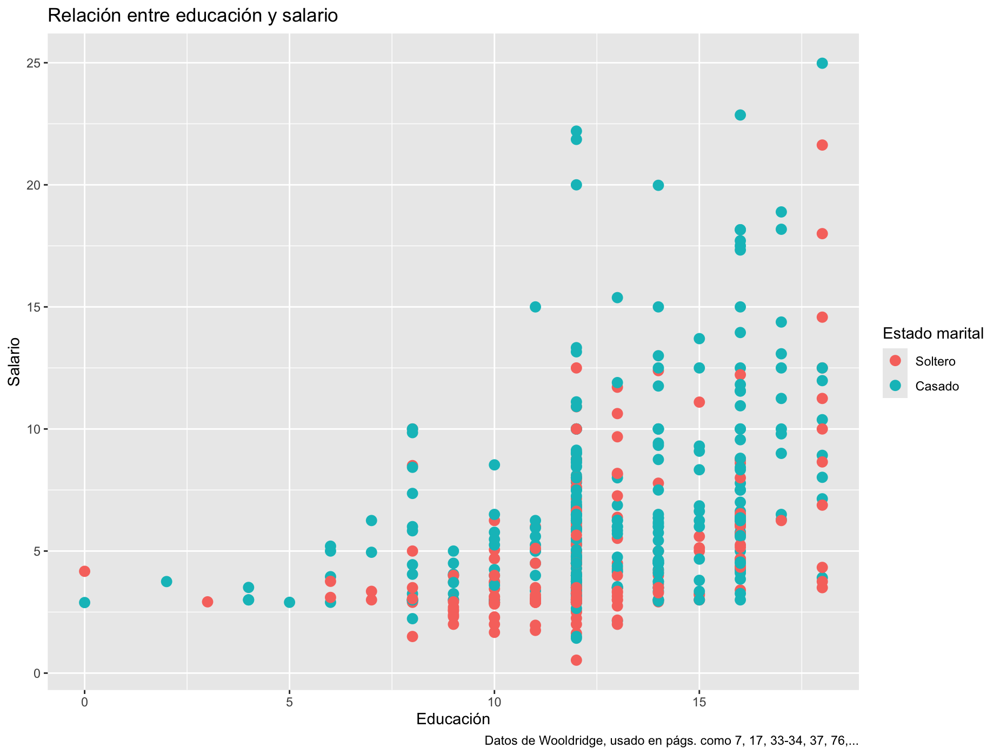
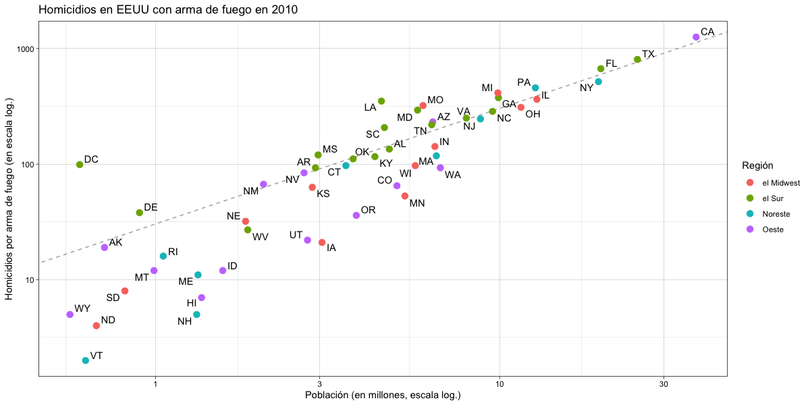
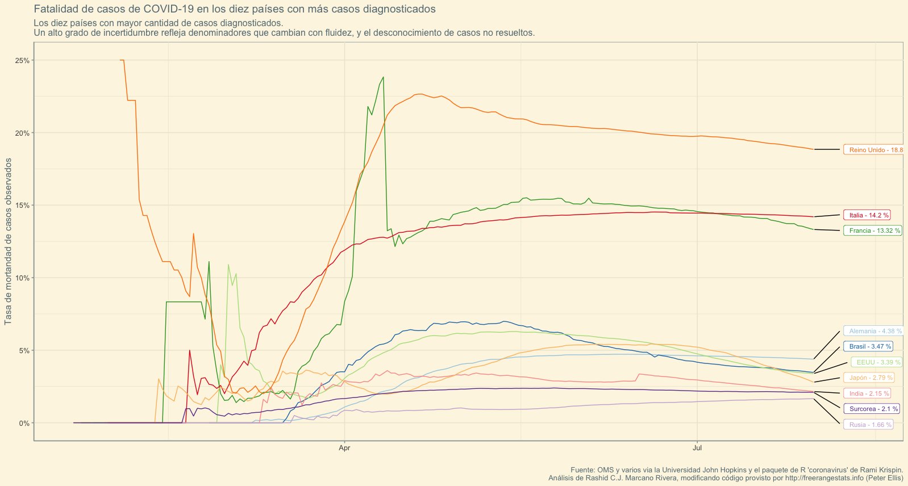

**Visualización de datos** Este es el segundo de tres talleres secuenciales de R a través de RStudio. Este taller está basado en viñetas de RStudio con tidyverse (en específico [`ggplot`,](https://ggplot2.tidyverse.org)) así como elementos y ejemplos del libro de Rafael Irizarry [disponible aquí](https://leanpub.com/dslibro) o de manera similar a los html producidos en este taller y y más actualizada [aquí](https://rafalab.dfci.harvard.edu/dslibro/). Finalmente la parte del censo proviene en parte de código ajustado del libro [Public Policy Analytics: Code & Context for Data Science in Government](https://urbanspatial.github.io/PublicPolicyAnalytics/introduction.html), por Ken Steif.

*Si aún no has instalado R, está [aquí](http://cran.us.r-project.org/). Acto seguido, [baja RStudio](https://posit.co/download/rstudio-desktop/). Puedes también ir a la nube [en Posit Cloud](https://posit.cloud/).*

# Visualización de datos: porqués

Ver números y cadenas de caracteres que forman un conjunto de datos puede ser interesante, o no, pero normalmente no tiene tanta utilidad. Por ejemplo:

```{r Cargando datos de Wooldridge}
library(wooldridge)

data(wage1)
head(wage1)

```

¿Qué aprendemos de ver estos datos así? ¿Podemos rápidamente determinar a si años de educación se traducen a mayores ingresos? ¿Podemos determinar si afecta en algo la relación marital? Para muchos humanos, es difícil extraer información con meramente mirar a números sin contexto adicional. Pero podríamos ver algo en este gráfico



Lo mismo podríamos hacer con los datos que trabajamos la semana pasada de homicidios con armas de fuego en EEUU:

```{r}
library(dslabs)
library(tidyverse)
data("murders")
tail(murders)
```

No podemos determinar con facilidad a qué estado le toca la población más grande o pequeña, y si existe alguna relación entre el tamaño de población y el total de asesinatos, o de cómo varían las tasas de asesinatos por regiones de estados en la federación estadounidense. Sin embargo, eso puede responderse sin muchas palabras con el próximo gráfico.



Una imagen vale más que mil palabras dice el dicho. Sin adentrarnos a la inferencia estadística (que cubriremos en la tercera semana de esta secuencia de talleres), hemos podido comunicar relaciones y hallazgos en datos. A veces puede ser este ejercicio uno tan convincente que no requiera análisis subsiguientes.

Vivimos en una era de creciente disponibilidad de conjuntos de datos informativos y de herramientas de software, con lo cual el uso de visualizaciones ha aumentado en diversos espacios: académicos, gubernamentales, organizaciones sociales, prensa, e industrias varias.

En R, una de las principales maneras con la que trabajaremos estos análisis visuales es de la mano de `ggplot2`, así como con otros paquetes que ayudan a procesar esta información. Si bien existen otros métodos de graficar en R y otros programas, la preferencia de este taller es utilizar el sistema de procesamiento que ofrece `tidyverse`, con `ggplot2` incluido.

Esta es una secuencia de tres semanas, y en esta lección continuamos con lo aprendido la semana anterior, donde terminamos con visualizaciones sencillas y con el uso de `tidyverse` para manejar datos. Tenemos la meta hoy de que al culminar las segundas dos horas de esta secuencia podamos:

1.  Entender cómo usar la gramática de gráficas

2.  Entender cómo usar `ggplot2`, continuando con lo aprendido de `tidyverse` de la semana pasada.

3.  Entender cómo utilizar en varias maneras `tidycensus` para generar mapas.

En la próxima sesión, del 10 de octubre, entraremos más en *wrangling* de datos, así como en la inferencia estadística, con introducciones en R sobre modelos lineales, jerárquicos y longitudinales, así como sus diagnósticos posteriores. 

# ggplot2

R ofrece varias opciones para graficar, siendo útiles las capacidades incluidas en su instalación básica. Además, existen paquetes como `grid`, que permite un control preciso de los elementos gráficos, y `lattice`, que facilita la creación de gráficos multivariados y en paneles o facetas. Sin embargo, en este taller (y en los libros de referencia usados y descritos arriba) se ha optado por usar `ggplot2`, ya que permite a los principiantes crear gráficos complejos y estéticos mediante una sintaxis intuitiva y fácil de recordar, dividiendo los gráficos en componentes básicos.

`ggplot2` destaca por su uso de una [*g*]{.underline}*ramática de [g]{.underline}ráficos* – de donde vienen las primeras dos g – que simplifica el proceso de creación de gráficos. Al aprender unos pocos componentes esenciales de esta gramática, los usuarios pueden generar una amplia variedad de gráficos con facilidad. Además, su comportamiento por defecto está diseñado para producir resultados agradables y funcionales con código conciso y legible, lo que facilita su uso por principiantes. Como factor limitante está el que está diseñado para trabajar con tablas de formato *tidy* (con filas con observaciones y columnas conteniendo variables), pero un número sustancial de conjuntos de datos se trabajan en ese formato, o pueden convertirse a ese formato.

## Componentes de un gráfico

Hoy construiremos varios tipos de gráficos como los que vimos arriba, así como mapas informativos. Antes que todo eso, vale señalar que los gráficos se dividen en tres componentes principales. Usaré otro gráfico que creara en 2020 durante la pandemia del Coronavirus para ejemplificar estos componentes.



-   **Datos**:
    -   Estoy pasando al gráfico un conjunto de datos que corté sobre fatalidad de casos de COVID-19 hasta el 31 de julio de 2020 (los datos continúan hasta 2023).
    -   Este es el componente de *datos* del gráfico.
-   **Geometrías**:
    -   El gráfico es uno de líneas, útil para varias series de tiempo. Este componente es una *geometría*. Otras geometrías posibles son gráficos de dispersión, histogramas, diagramas de barras, densidades suavizadas, y diagrama de cajas, entre otros.
-   **Mapeo estético**:
    -   El gráfico usa señales visuales para representar en el lienzo vacío con capas distintos tipos de información provista en el conjunto de datos:
        -   Posiciones en el eje de x (tiempo)
        -   Posiciones en el eje de y (tasas de mortandad observadas)
        -   Color (asignado por país)
    -   Cada línea representa la información de un país para una serie de fechas. Estos se aclaran con una etiqueta para aclararnos esa relación de línea-color-país.
    -   El *mapeo estético* depende de la geometría utilizada.
-   **Observaciones adicionales**:\
    -   Ejes *x* e *y* definidos por el rango de los datos y ambos en escalas logarítmicas.
    -   El gráfico incluye etiquetas, un título, etiquetas de variables, nota al calce, y el tema utilizado es uno solarizado que pareciera no muy distante al utilizado por el periódico especializado "The Financial Times".
-   Volveremos luego a estos datos para construir esta imagen si nos da tiempo en el taller, y si no, tendrán disponible el cómo hacerlo para referencia.

## Lienzo vacío y capas

Manteniéndonos cerca de los datos utilizados en la semana pasada, construiremos por ***capas*** la información que va en el gráfico.

```{r Un lienzo en blanco}
murders |> ggplot()
```

El primer paso de crear un gráfico de ggplot es asignar los datos a un lienzo vacío. Esto no significa poblar el lienzo con esos datos, sino pasarle al programa la información inicial, como un pintor que selecciona el tema que usará para la pintura que visualiza en su mente. Esto lo hicimos al pasar el *pipe* (`|>` o `|>`) los datos a ggplot, y lo que ocurrió fue que al no darle más información (capas, como la pintura en un lienzo), nos quedó un recuadro gris enmarcado por un borde blanco.

En ggplot, la información entonces se suministra al lienzo por capas, y se le pueden añadir adicionales. Esto tomará la forma de código siguiente:

| DATOS \|\> ggplot() + CAPA 1 + 
| CAPA 2 + ... + CAPA N

Usualmente, la primera capa que añadimos define la geometría. Si queremos hacer un diagrama de dispersión, ¿qué geometría deberíamos utilizar?

Si vemos la hoja de referencia (en la carpeta del taller 2, o accesible en esta página: <https://github.com/rstudio/cheatsheets/blob/main/data-visualization.pdf>), vemos que la función utilizada para crear gráficos con esta geometría puntillista es `geom_point`.

```{r Añadiendo una geometría}
murders |>
  ggplot() +
  geom_point(aes(x = population/10^6, y = total))

```

En este caso ya hemos dado un paso adicional y añadido una primera capa en esta obra: le indicamos que queremos una capa que tenga una geometría de puntos, y un mapeo estético que toma las coordenadas en un plano cartesiano donde el eje de equis queda definido como `population/10^6`, la población de los estados o Wáshington D.C., en millones; el eje de ye queda definido entonces como el total de asesinatos con armas de fuego. En el mapeo estético entonces los puntos quedan asignados a esas coordenadas. De esta manera, las distancias entre puntos, así como otras características que queramos añadir, quedan expresadas. Esto se da a través de la función `aes`. Esta será de las funciones que más usen al graficar.

Noten que hasta ahora hemos trabajado este lienzo sin guardarlo como objeto. Si bien esto puede funcionar bien, es posible que queramos guardar nuestro progreso y seguir añadiendo capas adicionales. En este caso, al ejecutar el comando y guardarlo en objeto, el programa no nos dará automáticamente una actualización del gráfico; tendremos que llamar al objeto para que aparezca:

```{r}
p<-murders |>
  ggplot() +
  geom_point(aes(x = population/10^6, y = total),size=2)

p
```

Tenemos entonces nuestro gráfico de dispersión inicial. Quizás no es tan informativo pero vemos una serie de puntos con el mapeo estético inicial. Noten que podríamos quitar la `x=` y la `y=` y no pasaría nada, ya que en ausencia de esta especificación, el programa entiende por defecto que lo primero que se le asigna es la información del eje horizontal, y en segundo orden el vertical:

```{r Añadiendo etiquetas}
p+
  geom_text(aes(population/10^6, total, label = abb))
```

Aquí he añadido una geometría nueva: texto. Hay dos geometrías para esto, `geom_label` y `geom_text`, uno con el texto enmarcado en un recuadro y el segundo sin ello. Ya que cada punto (cada jurisdicción que es realmente parte de los Estados Unidos de América en este caso) tiene una etiqueta, necesitamos un mapeo estético para hacer la conexión entre los puntos y las etiquetas, así que se le asignó el mismo tal que el texto cayera exactamente en la misma coordenada que el punto. Pero esto se puede corregir:

```{r Empujando etiquetas en el eje}
p+
  geom_text(aes(population/10^6, total, label = abb),nudge_x = 1.5) 
#nudge_y desplazaría el texto en el eje de y
```

En este caso hemos empujado a través del eje de equis la etiqueta de texto con un valor numérico de 1.5. Valores mayores aumentarían la distancia del texto y el punto, mientras que menores harían lo contrario.

Ahora podremos seguir con una complicación en el mapeo estético: queremos añadir una capa de color al lienzo que represente regiones de estas jurisdicciones. Esto se hace al añadir la opción de `colour` y dándole una variable, en este caso `region`.

```{r Añadiendo color}
# Crear el gráfico base con puntos coloreados por región
p <- murders |>
  ggplot() +
  geom_point(aes(x = population/10^6, y = total, colour = region), size = 2)

# Mostrar el gráfico
p
```

Ahora paso nuevamente a añadir etiquetas abreviadas, con el color por región.

```{r Añadiendo nuevamente etiquetas de abreviación jurisdiccional}
# Añadir etiquetas desplazadas en el eje x (con color por región)
p<-p + 
  geom_text(aes(x = population/10^6, y = total, label = abb, colour = region), nudge_x = 1.5)
p
```

Y para darle más información al gráfico le añadimos etiquetas y títulos que sean más informativas que los nombres de variables.

```{r Añadiendo títulos}
#démosle más información a la gráfica de dispersión.

p+labs(
  x = "Población (en millones)",   # Cambia el nombre del eje x
  y = "Homicidios con arma de fuego",            # Cambia el nombre del eje y
  colour = "Región",              # Cambia el nombre de la leyenda de color
  title = "Homicidios con arma de fuego en EEUU, 2010"  # Título del gráfico
)
```

Hasta ahora hemos ido añadiendo capas pero notamos que tenemos una gran concentración de puntos en la parte inferior izquierda del lienzo: la mayoría de las jurisdicciones tienen menos de 10 millones de habitantes y menos de 400 homicidios. Esto hace leer e interpretar lo que sucede en para estos casos difícil. Podríamos entonces representar el gráfico con una transformación logarítmica al re-escalar con `scale_x_continuous` y `scale_y_continuous`:

```{r Haciendo una transformación de escala}
p2<-murders |>
  ggplot() +
  geom_point(aes(x = population/10^6, y = total, colour = region), size = 3)
p2<- p2 + geom_text(aes(x = population/10^6, y = total, label = abb),nudge_x = 0.05)
p2<-p2+scale_x_continuous(trans = "log10")+
  scale_y_continuous(transform = "log10")
p2<-p2+
  labs(
    x = "Población (millones, escala log.)",   # Cambia el nombre del eje x
    y = "Homicidios por arma de fuego (escala log.)",            # Cambia el nombre del eje y
    colour = "Región",              # Cambia el nombre de la leyenda de color
    title = "Homicidios por arma de fuego vs población, por región"  # Título del gráfico
  )
p2
```

Podríamos añadir una capa temática, usando el paquete `ggthemes`, que tiene un catálogo estético variado, que recomiendo verifiquen a través de <https://yutannihilation.github.io/allYourFigureAreBelongToUs/ggthemes/>. Esto es en adición a los que ya ofrece el paquete de `ggplot2` <https://ggplot2.tidyverse.org/reference/ggtheme.html>.

En este caso le añadiré una visualización al estilo del semanario británico *The Economist.*

```{r Añadiendo temas}
library(ggthemes)
p2 + theme_economist()
```

## El gráfico que buscábamos

Normalmente queremos añadir formas o anotaciones a las figuras que no se derivan directamente del mapeo estético; algunos ejemplos incluyen etiquetas, cuadros, áreas sombreadas y líneas. Si queremos añadir una línea que represente la tasa promedio de asesinatos en todos los Estados Unidos, tendremos que determinarlo aparte con la ayuda de `dplyr` (parte de `tidyverse`), y tendremos que hacer la transformación adecuada también (logarítmica):

```{r el gráfico que buscábamos (datos de asesinatos)}
library(ggthemes)
library(ggrepel)
library(dslabs)
t <- murders |> 
  summarise(tasa = sum(total) /  sum(population) * 10^6) |>
  pull(tasa)

murders |> 
  mutate(región=case_when(
    region == "Northeast" ~ "Noreste",
    region == "North Central" ~ "el Midwest",
    region == "West" ~ "Oeste",
    region == "South" ~ "el Sur"))|>
  ggplot(aes(population/10^6, total)) +   
  geom_abline(intercept = log10(t), lty = 2, color = "darkgrey") +
  geom_point(aes(col = región), size = 3) +
  geom_text_repel(aes(label = abb)) + 
  scale_x_log10() +
  scale_y_log10() +
  labs(title = "Homicidios en EEUU con arma de fuego en 2010",
       x = "Población (en millones, escala log.)", 
       y = "Homicidios por arma de fuego (en escala log.)",
       color = "Región") +
  theme_linedraw()
```

He aquí los pasos entonces que necesitábamos para recrear la imagen arriba.'

## Gráficos rápidos: `qplot()`

Si bien esto ha sido útil y han podido ver cómo generar gráficas complejas siguiendo la gramática de gráficos, es probable que en algún momento quieran ver rápidamente unas relaciones visuales de manera instantánea, con la intención luego de volver y darle mejor forma y seguir las complicaciones de un gráfico de `ggplot2` con todas sus capas. La opción que da `ggplot2` a esto es el uso de `qplot()`.

Por ejemplo, aquí modifiqué los grupos de jurisdicciones de Estados Unidos a unos grupos específicos, y creo un gráfico para ver densidades con relleno (`fill=grupo`) y con líneas que también sirven para demarcar estos grupos de manera distinta (e.g. línea sólida, línea entrecortada). Noten que ha corrido todo el gráfico de la última línea.

```{r Un qplot inicial}
murdersg<-murders |>
  mutate(tasa= total/population *10^5,
    ,grupo = case_when(
    abb %in% c("ME", "NH", "VT", "MA", "RI", "CT") ~ "Nueva Inglaterra",
    abb %in% c("WA", "OR", "CA") ~ "Costa del Pacífico",
    region == "South" ~ "el Sur",
    TRUE ~ "Otras regiones"))
qplot(tasa, data = murdersg, geom= "density", fill = grupo, linetype=grupo)
```

En las siguientes líneas pido y ejecuto variaciones de gráficos con qplot con los datos de altura del libro de Irizarry:

```{r Varios qplots}
data(heights)            
b<-heights|>ggplot()
qplot(sex, height, data = heights, geom= "boxplot", fill = sex)
qplot(sex, height, data = heights, geom= "violin", fill = sex)
qplot(sex, height, data = heights, geom = "dotplot",
      stackdir = "center", binaxis = "y", dotsize = 0.3)
qplot(height, data = heights, geom = "density", fill = sex)
qplot(height, data = heights, geom = "density", color = sex, linetype = sex)
```

Nuevamente podríamos mostrar información adicional, como medias añadidas fuera de las estéticas definidas dentro del mapeo:

```{r Dando a densidades transparencias}
mu_alt<-heights |>
  group_by(sex) |>
  summarise(media=mean(height))

c<-heights|>ggplot(aes(x = height))
c+geom_density(aes(fill = sex), alpha=0.4) #el alpha le da un nivel de transparencia 
#¿qué creen que pase si suben el valor a 0.9 o lo reducen a 0.1?
```

Noten que si tenemos dos categorías, al pedir color, tiende a establecer a uno con un rojo magenta y al segundo con un azul cian (aciano o ciano), en este caso suavizado y transparentado para poder ver las distribuciones. Sin embargo, podemos editar el color manualmente, a la vez que añadimos complicaciones como una media de alturas por grupo.

```{r Añadiendo color manualmente}
c+ geom_density(aes(color = sex)) +
  geom_vline(data=mu_alt, aes(xintercept=media, color=sex),
             linetype="dashed") +
  scale_color_manual(values=c("#999999", "#E69F00")) #noten que aquí le di los colores con código alfanumérico, un gris plateado y un dorado.
```

Hay varios métodos para asignar colores al nombrarlos en R. Se puede hacer por nombre (en inglés), con códigos alfanúmericos, y se puede también importar paletas de colores con paquetes específicos. Considero útil revisar las opciones en este enlace: <https://r-graph-gallery.com/ggplot2-color.html>

## Alcanzando visualización de densidades y sus cambios a través del tiempo

```{r}
library(dslabs)
data(gapminder)
gapminder |> as_tibble()
```

Vemos que estos datos incluyen una variedad de información a nivel de país, que incluye un número de años para ellos.

Podemos ver los grupos de países por continentes usando una matriz de gráficos, con cuadrículas paradas y acostadas:

```{r}
filter(gapminder, year%in%c(1962, 2012)) |>
  ggplot(aes(fertility, life_expectancy, colour = continent)) +
  geom_point() +
  facet_grid(continent~year)

filter(gapminder, year%in%c(1962, 2012)) |>
  ggplot(aes(fertility, life_expectancy, col = continent)) +
  geom_point() +
  facet_grid(. ~ year)

years <- c(1962, 1980, 1990, 2000, 2012,2015)
continents <- c("Europe", "Asia")
gapminder |>
  filter(year %in% years & continent %in% continents) |>
  ggplot( aes(fertility, life_expectancy, colour = continent)) +
  geom_point() +
  facet_wrap(~year)+labs(x="Fertilidad", y="Esperanza de vida",colour="Continente")
```

En este caso podemos apreciar mejor cómo la dispersión y distribución de países entre los años 1960s y el presente reciente ha ido encaminado a una convergencia en estándares de vida, dejando atrás los puntos donde originaron estereotipos que aún persisten sobre cómo son las vidas y experiencias de distintas regiones del planeta (sin desestimar diferencias e inequidades presentes).

```{r Creando visualización sobre ingresos diarios}
gapminder <- gapminder |> mutate(dólares_diarios = gdp/population/365)

antaño <- 1970

gapminder |>
  filter(year == antaño & !is.na(gdp)) |>
  mutate(region = reorder(region, dólares_diarios, FUN = median)) |>
  ggplot(aes(dólares_diarios, region)) +
  geom_point() +
  scale_x_continuous(trans = "log2")
```

```{r Creando categorías para ver mejor dinámicas}
gapminder <- gapminder |>
  mutate(grupo = case_when(
    region %in% c("Western Europe", "Northern Europe","Southern Europe",
                  "Northern America",
                  "Australia and New Zealand") ~ "Occidente",
    region %in% c("Eastern Asia", "South-Eastern Asia") ~ "Asia oriental",
    region %in% c("Caribbean", "Central America",
                  "South America") ~ "Latinoamérica",
    continent == "Africa" &
      region != "Northern Africa" ~ "África subsahariana",
    TRUE ~ "Otros"))
#le damos orden a los niveles
gapminder <- gapminder |>
  mutate(grupo = factor(grupo, levels = c("Otros", "Latinoamérica",
                                          "Asia oriental", "África subsahariana",
                                          "Occidente")))

p <- gapminder |>
  filter(year == antaño & !is.na(gdp)) |>
  ggplot(aes(grupo, dólares_diarios)) +
  geom_boxplot() +
  scale_y_continuous(trans = "log2") +
  xlab("") +
  theme(axis.text.x = element_text(angle = 90, hjust = 1))
p
p + geom_point(alpha = 0.5) #añadiendo puntos para ver mejor distribuciones y cantidad de casos
```

```{r Densidades}
library(ggridges)
p <- gapminder |>
  filter(year == antaño & !is.na(dólares_diarios)) |>
  ggplot(aes(dólares_diarios, grupo)) +
  scale_x_continuous(trans = "log2")
p + geom_density_ridges()
```

```{r Densidades con información de observaciones}
p + geom_density_ridges(jittered_points = TRUE,
                        position = position_points_jitter(height = 0),
                        point_shape = '|', point_size = 3,
                        point_alpha = 1, alpha = 0.7) 
```

```{r Histogramas comparativos en facetas}
antaño <- 1970
año_presente <- 2010

years <- c(antaño, año_presente)
gapminder |>
  filter(year %in% years & !is.na(gdp)) |>
  mutate(west = ifelse(grupo == "Occidente", "Occidente", "El Resto")) |>
  ggplot(aes(dólares_diarios)) +
  geom_histogram(binwidth = 1, color = "black") +
  scale_x_continuous(trans = "log2") +
  facet_grid(year ~ west)
```

Sabemos que muchos países surgieron después de 1970 (razón por la cual el histograma se nutre para el grupo **El Resto**), así que para comparar los países que tienen toda la información y han existido consistentemente entre esos periodos y ver si hay cambios y de dónde surgen en distribuciones podemos hacer lo siguiente:

```{r Wrangling para comparar chinas con chinas}
country_list_1 <- gapminder |>
  filter(year == antaño & !is.na(dólares_diarios)) |>
  pull(country)

country_list_2 <- gapminder |>
  filter(year == año_presente & !is.na(dólares_diarios)) |>
  pull(country)

country_list <- intersect(country_list_1, country_list_2)

gapminder |>
  filter(year %in% years & country %in% country_list) |>
  ggplot(aes(grupo, dólares_diarios)) +
  geom_boxplot() +
  theme(axis.text.x = element_text(angle = 90, hjust = 1)) +
  scale_y_continuous(trans = "log2") +
  xlab("") +
  facet_grid(. ~ year)

gapminder |>
  filter(year %in% years & !is.na(dólares_diarios)) |>
  ggplot(aes(dólares_diarios, grupo)) +
  scale_x_continuous(trans = "log2") +
  geom_density_ridges(adjust = 1.5) +
  facet_grid(. ~ year)

gapminder |>
  filter(year %in% years & country %in% country_list) |>
  group_by(year) |>
  mutate(weight = population/sum(population)*2) |>
  ungroup() |>
  ggplot(aes(dólares_diarios, fill = grupo)) +
  scale_x_continuous(trans = "log2", limit = c(0.125, 300)) +
  geom_density(alpha = 0.2, bw = 0.75, position = "stack") +
  facet_grid(year ~ .)+labs(title = "Densidades apiladas: ingreso en dólares por día per cápita entre 1970 y 2010",
         x = "Dólares por día", 
         y = "Densidad",
         color = "Regiones")

```

## Datos del Covid

Durante la pandemia del Coronavirus de 2019, todos pasamos por bastantes cosas, entre ellas, tratar de entender el fenómeno inaudito en nuestras vidas, que era una mortífera y peligrosa pandemia, de la cual desconocíamos en general muchas características. Esto llevó a los gobiernos del mundo a tomar distintos tipos de acciones y nos informábamos con gráficas así como números y tablas del progreso de la enfermedad y su avance a través de los países del planeta, así como la variable tasa de mortalidad que la acompañaba. Varios científicos lanzaron programas para recoger y expresar estos datos al público general para mantenernos todos bien informados.

En mi caso tomé código y datos que se recogían a menudo y produje por unos meses varios tipos de gráficos para representar el desarrollo de la pandemia (y tratar de entender qué ocurría de una manera que yo pudiera digerir e informar). Aquí doy una versión del código que utilicé para estos fines (modificando las fechas ya que se siguió recopilando esa información mucho después de cuando dejara de actualizar esos gráficos.

```{r Creando e importando el dataframe}
#devtools::install_github("RamiKrispin/coronavirus",force = TRUE)
library(coronavirus)
library(scales)
coronavirus<-coronavirus
the_caption = "Fuente: OMS y varios via la Universidad John Hopkins y el paquete de R 'coronavirus' de Rami Krispin.\nAnálisis de Rashid C.J. Marcano Rivera, modificando código provisto por http://freerangestats.info (Peter Ellis)"
top_countries <- coronavirus |>
  filter(date <= as.Date("2020-07-31")) |>
  filter(type == "confirmed") |>
  group_by(country) |>
  summarise(cases = sum(cases)) |>
  top_n(10, wt = cases)

d2 <- coronavirus |>
  filter(date <= as.Date("2020-07-31")) |>  # Filtro para datos dentro de 2020
  group_by(date, country, type) |>
  summarise(cases = sum(cases)) |>
  group_by(date, country) |>
  spread(type, cases) |>
  arrange(date) |>
  group_by(country) |>
  mutate(cfr_cumulative = cumsum(death) / cumsum(confirmed)) |>
  filter(!is.na(cfr_cumulative)) |>
  ungroup() |>
  inner_join(top_countries, by = "country") 

summary(as.factor(d2$country))
today<-as.Date("2020-08-06")
x_limits <- c(today, NA)

top_countries
```

Vemos que los países están en inglés pero queremos que aparezcan en nuestro gráfico en español (ya que interesa informar en mi caso a un público hispanófono). Podemos modificar la información con los paquetes de `tidyverse`:

```{r Modificando la información }
d2<- d2 |>
  mutate(country=recode(country, US = "EEUU", Russia ="Rusia", Mexico = "México", Brazil = "Brasil", 
                        "United Kingdom" = "Reino Unido", Japan="Japón",
                        Italy = "Italia", Iran = "Irán", Peru = "Perú",
                        "South Africa"= "Sudáfrica"))
d2<- d2 |>
  mutate(cfr_cumulativeperc=round(cfr_cumulative*100,2))
```

Finalmente, expresamos el gráfico buscado. Paso los datos de mapeo estético como opciones globales y le añado las capas: líneas para series de tiempo, etiquetas automáticamente posicionadas (pero editadas para especificar dónde las quiero y añadir información adicional), transformaciones numéricas, información adicional de selección colores, una extensión del marco para acomodar las etiquetas, así como los títulos que deseara utilizar:

```{r Creando la visualización}
d2 |>
  ggplot(aes(x = date, y = cfr_cumulative, colour = country)) +
  geom_line() +
  geom_label_repel(data = filter(d2, date == max(date)), aes(label = paste("",country,"-",cfr_cumulativeperc,"%")), 
                   hjust = 1, size = 3, xlim = x_limits, segment.color="black"	) +
  scale_y_continuous(label = percent_format(accuracy = 1), limits = c(0, .25)) +
  scale_colour_brewer(type = 'qual', palette = 'Paired', direction = 1) +
  expand_limits(x = max(d2$date) + 13) +
  labs(caption = the_caption,
       x = "",
       y = "Tasa de mortandad de casos observados",
       title = "Fatalidad de casos de COVID-19 en los diez países con más casos diagnosticados",
       subtitle = "Los diez países con mayor cantidad de casos diagnosticados. El caso de Irán ha sido truncado en sus primeras observaciones. 
Un alto grado de incertidumbre refleja denominadores que cambian con fluidez, y el desconocimiento de casos no resueltos.") +
  theme_solarized()+  theme(legend.position = "none")
```

# Datos del censo

En este bloque introductorio, utilizamos los datos del Censo de Estados Unidos para obtener variables demográficas y socioeconómicas de Puerto Rico. Los datos del Censo nos permiten comprender mejor las características de la población, como ingresos, educación, vivienda, y más, a lo largo del tiempo. Para este ejercicio, hacemos uso de `tidycensus`, una poderosa herramienta que facilita la descarga y manipulación de los datos censales dentro del entorno de R.

El primer paso es cargar las bibliotecas necesarias, como `tidyverse`, `tidycensus` y `sf`. La combinación de estas bibliotecas nos permitirá no solo acceder a los datos, sino también analizarlos y visualizarlos espacialmente en mapas. Es importante también tener configurada una clave API de la Oficina del Censo para poder acceder a los datos.

Luego, se configura el entorno con algunas opciones útiles:

-   `scipen = 999`: Evita el uso de notación científica en los números, lo cual facilita la lectura de resultados.

-   `tigris_class = "sf"`: Permite manejar las geometrías de manera eficiente mediante `sf`, una clase para manejar datos geoespaciales. A continuación, se usan las funciones de `tidycensus` para cargar variables específicas de diversos conjuntos de datos censales, como la Encuesta de la Comunidad Americana (ACS), la Encuesta de la Comunidad de Puerto Rico (PRCS, que se obtiene aquí vía la función de ACS) y los datos del Censo Decenal. Cada conjunto de datos proporciona información clave sobre diferentes periodos: anual, quinquenal y decenal. Finalmente, mostramos las variables disponibles que podemos utilizar para análisis posteriores.

```{r Censo}
library(tidyverse)
library(tidycensus)
library(sf)
#census_api_key(INSERTE SU LLAVE DEL CENSO AQUÍ)

options(scipen=999)
options(tigris_class = "sf")
#https://api.census.gov/data.html
census_variables <- load_variables(year = 2020, dataset = "acs5", cache = TRUE)
#ensus_variablessf1 <- load_variables(year = 2020, dataset = "sf1", cache = TRUE)
#census_variablessf2 <- load_variables(year = 2020, dataset = "sf2", cache = TRUE)
#census_variables4Redist <- load_variables(year = 2020, dataset = "pl", cache = TRUE)
#v00 <- load_variables(2000, "sf3", cache = TRUE))
v18 <- load_variables(2018, "acs5", cache = TRUE)
v10 <- load_variables(2010, "sf1", cache = TRUE)
census_variables
v10
v18
```

Podemos pasar por las variables en catálogo y seleccionar la que nos llame más la atención. Recomiendo verifiquen las variables a través de `View(variables)` ya que pueden usar una opción para filtrar e ir buscando entre las miles de opciones que tienen para uso. En este caso, quiero revisar para algún futuro trabajo de investigación datos sobre el ingreso mediano de los distritos representativos de Puerto Rico para los años 2018 y 2019 (que en el Censo aparecen como geografía tipo `state legislative district (lower chamber)`). Usaré la función `get_acs`, podemos ver qué hace:

```{r ACS: información}
?get_acs
help("get_acs")
```

Para efectos estadísticos Puerto Rico entra como estado en estos datos. Uso entonces la variable `B19013_001` que da los ingresos medianos por hogar.

```{r Ingresos}
prmedian_2019 <- get_acs(geography = "state legislative district (lower chamber)", 
              variables = c(medincome = "B19013_001"), 
              state = "PR", 
              year = 2019)
prmedian_2018 <- get_acs(geography = "state legislative district (lower chamber)", 
                    variables = c(medincome = "B19013_001"), 
                    state = "PR", 
                    year = 2018)
head(prmedian_2018)
pr_median_combined <- prmedian_2019 |>
  mutate(year = 2019) |>
  bind_rows(
    prmedian_2018 |> mutate(year = 2018)
  )
head(pr_median_combined)
```

Habiendo obtenido las tablas, digamos que no quiero hacer sólo un análisis numérico a ojo. El ojo y mente humana rara vez puede determinar mucho al ver una colección grande de estos datos rápidamente.

Pero al visualizar, podemos mejorar algo la velocidad en lo que entendemos algo más de lo que está ante nos.

```{r Ingresos por distrito, cambios en encuestas}
pr_median_combined <- pr_median_combined |>
  filter(!is.na(estimate))  # Filter out rows where the estimate is NA

pr_median_combined|>
  ggplot(aes(x = NAME, y = estimate, fill = factor(year))) +
  geom_bar(stat = "identity", position = position_dodge(), color = "black") +
  geom_errorbar(aes(ymin = estimate - moe, ymax = estimate + moe), 
                position = position_dodge(0.9), width = 0.25) +
  scale_y_continuous(labels = scales::dollar_format()) +
  labs(
    title = "Ingreso mediano por distrito legislativo en Puerto Rico (2018 vs 2019)",
    x = "Distrito representativo",
    y = "Ingreso mediano",
    fill = "Año"
  ) +
  theme_minimal() +
  theme(
    axis.text.x = element_text(angle = 90, vjust = 0.5, hjust = 1)  # Rotar nombres de distritos 90 grados para legibilidad
  )

```

Noten que ordenó los distritos de una manera extraña: el 4 aparece antes de 40 y todos del 5 al 9 se fueron como posteriores al 40. Voy a corregir y renombrar los distritos:

```{r Haciendo cambios a nombres de distritos}
pr_median_combined <- pr_median_combined |>
  # Extraer el número del distrito desde el nombre original y convertirlo en numérico
  mutate(district_number = as.numeric(gsub(".*District ([0-9]+).*", "\\1", NAME))) |>
  # Renombrar el campo NAME para que tenga el formato "Distrito 01" hasta "Distrito 40"
  mutate(NAME = sprintf("Distrito %02d", district_number)) |>
  # Ordenar los datos según el número de distrito
  arrange(district_number)

# Crear el gráfico nuevamente
pr_median_combined |>
  ggplot(aes(x = NAME, y = estimate, fill = factor(year))) +
  geom_bar(stat = "identity", position = position_dodge(), color = "black") +
  geom_errorbar(aes(ymin = estimate - moe, ymax = estimate + moe), 
                position = position_dodge(0.9), width = 0.25) +
  scale_y_continuous(labels = scales::dollar_format()) +
  labs(
    title = "Ingreso mediano por distrito representativo en Puerto Rico (2018 vs 2019)",
    x = "Distrito representativo",
    y = "Ingreso mediano",
    fill = "Año"
  ) +
  theme_minimal() +
  theme(
    axis.text.x = element_text(angle = 90, vjust = 0.5, hjust = 1)  # Rotar nombres de distritos 90 grados para legibilidad
  )

```

Finalmente, usaremos esta información para generar un mapa geospacial con ggplot. En este caso tomamos como parte de los pasos una transformación de coordenadas para que el mapeo entienda dónde posicionar las geometrías en el mapeo estético.

```{r Ingreso mediano en mapa}
library(tigris)

pr_legislative_districts <- state_legislative_districts(state = "PR", house = "lower", year = 2018)
pr_legislative_districts <- st_transform(pr_legislative_districts, crs = "EPSG:4326")  # ajustar proyección tal cual necesario
pr_median_2018_geo <- pr_legislative_districts |>
  left_join(prmedian_2018, by = c("GEOID" = "GEOID"))  
pr_median_2018_geo|>
  ggplot() +
  geom_sf(aes(fill = estimate)) +
  scale_fill_viridis_c(option = "plasma", name = "Ingreso mediano") +
  theme_minimal() +
  labs(
    title = "Ingreso mediano por distrito representativo (2018)",
    fill = "Ingreso mediano"
  )

```

En este bloque próximo, utilizamos datos espaciales y demográficos para mapear la población de Puerto Rico a nivel de tractos censales del censo de 2020. Combinamos dos fuentes de información: una capa espacial con los límites geográficos de los tractos (la forma de los polígonos en un *shapefile*: <https://electionspuertorico.org/datos/2020/#MAPA>) y los datos poblacionales del Censo Decenal de 2020.

1.  El shapefile nos proporciona los límites de los tractos que necesitamos para asignar la información demográfica correctamente.

-   **`st_read()`**: Carga el shapefile, aplicando la codificación `latin1` para asegurarnos de que los caracteres especiales (acentos, diéresis, eñes) en los nombres se lean correctamente.

-   **`st_set_crs()` y `st_transform()`**: Aquí ajustamos el CRS (sistema de referencia de coordenadas) de la capa geográfica. Primero asignamos el CRS EPSG:4326 (coordenadas geográficas), y luego transformamos la capa a EPSG:3920 (un CRS proyectado que es común para Puerto Rico) para asegurar que todas las capas estén en el mismo sistema de referencia.

2.  **Datos de población**: Usamos `tidycensus` para obtener los datos de población de Puerto Rico a nivel de tractos censales del censo de 2020.
    -   **`get_decennial()`**: Esta función descarga los datos de población (variable `P1_001N`, que representa el total de la población). La opción `geometry = TRUE` incluye la geometría de los tractos, lo cual nos permite hacer un análisis espacial directamente.

    -   **`st_transform()`**: Aplicamos la misma transformación de CRS a los datos de población para que coincidan con la capa geográfica de los tractos.
3.  **Unión espacial**: Utilizamos `st_join()` para combinar los datos espaciales y de población, uniendo la capa de tractos con los datos del censo según el campo `GEOID`. Esto nos permite representar los datos poblacionales en el mapa.

```{r,echo=F}
folder<-getwd()
```

```{r}
# Este archivo lo descargué el 9 de agosto de 2022 desde https://electionspuertorico.org/datos/2020/PR2020TV.zip
folder<-"~/Library/CloudStorage/OneDrive-IndianaUniversity/Elecciones/Rashid and Brevin/"

pr_unidad_shp_filename <- paste(folder, "PR2020Shp/PR2020TV.shp", sep= "")
pr_unidades <- st_read(pr_unidad_shp_filename, options = "ENCODING=latin1")
st_set_crs(pr_unidades, "EPSG:4326")

pr_unidades <- pr_unidades |> st_transform(crs = "EPSG:3920")
plot(pr_unidades)

```

```{r Población}
pr_population <- get_decennial(
  geography = "tract", 
  variables = "P1_001N", 
  state = "72",   # FIPS code for Puerto Rico
  year = 2020, 
  geometry = TRUE
)

pr_population <- st_transform(pr_population, crs = "EPSG:3920")
pr_unidades <- pr_unidades |>
  st_join(pr_population, by = c("GEOID" = "GEOID"))  # Asumiendo que comparten GEOID en común
pr_unidades|>ggplot() +
  geom_sf(aes(fill = value)) +  # `value` is the population count
  scale_fill_viridis_c(option = "plasma", name = "Population") +
  theme_minimal() +
  labs(title = "Población de Puerto Rico por tracto censal (2020)")
```

```{r}
pr_unidades
```

Podré llevarme estos datos para otros análisis en el futuro (o con datos más útiles).

En este bloque, generamos un mapa que muestra la **población por tracto censal** en Puerto Rico. Cada tracto está coloreado según su población, lo que nos permite visualizar cómo se distribuye la población a lo largo de la isla.

-   **`geom_sf(aes(fill = value))`**: Aquí, visualizamos los tractos censales y asignamos un color a cada uno de acuerdo con su población (`value`).

-   **`scale_fill_viridis_c()`**: Utilizamos una escala de color continua, con la opción `plasma`, para mejorar la legibilidad de los datos.

-   **`labs()`**: Añadimos un título al gráfico y una leyenda clara para que el lector entienda fácilmente la visualización.

# Recapitulando

## Qué aprendimos en este taller inicial

Hoy aprendimos varias cosas en R:

-   Aprendimos principios de visualización
-   Lenguaje de gramática de gráficos
-   Uso de capas para añadir complejidad visual a los datos
-   Gráficas con datos complejos
-   Uso de tidycensus para descargar datos censales
-   Gráficos con mapas

## Continuamos el próximo viernes

En el taller que vienen continuaremos ahondando en operaciones estadísticas, así como estadística inferencial, y finalmente gráficos que ayuden a entender y diagnosticar los modelos estadísticos que usaremos. Gracias por asistir hoy.
